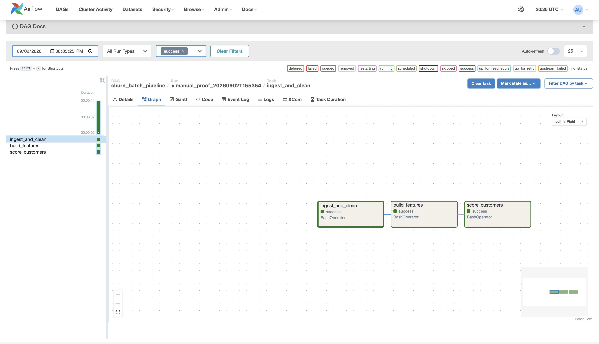
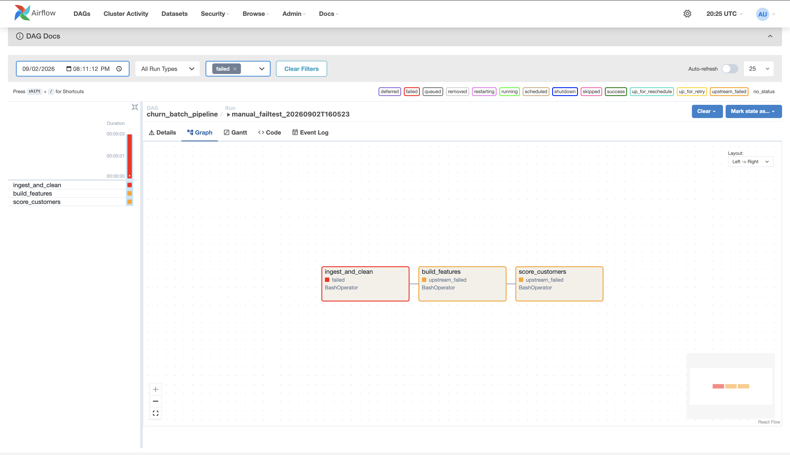

# Customer Churn Prediction Pipeline

**Live dashboard: https://dadruz-churn-pipeline.streamlit.app/**

An end-to-end churn prediction pipeline built on the IBM Telco customer dataset.
Raw CSV is ingested into DuckDB as all-VARCHAR and cleaned into a typed table
behind a data quality gate that halts the pipeline on bad input. Exploratory
analysis drives a feature module, three candidate models are compared under
stratified cross-validation, and the selected model's decision threshold is tuned
for recall on out-of-fold predictions rather than on the test set. Apache Airflow
orchestrates the batch scoring path, and a Streamlit dashboard presents the
scored customers and the resulting retention shortlist.

---

## Architecture

```
  raw CSV              DuckDB                      features            model              export              dashboard
  -------              ------                      --------            -----              ------              ---------
  data/raw/     -->    raw_customers        -->    build_features -->  churn_model  -->   scored_        -->  Streamlit
  Telco.csv            clean_customers             src/features.py     .joblib            customers.csv       app.py
                       data_quality_checks
                              |
                              +-- any check fails --> non-zero exit --> DAG halts, downstream tasks skipped

  +-- Airflow DAG: churn_batch_pipeline (manual trigger, catchup=False) ----------------+
  |     ingest_and_clean   -->   build_features   -->   score_customers                 |
  |     src/run_sql.py           src/features.py        src/evaluate.py                 |
  +-------------------------------------------------------------------------------------+

  src/train.py is deliberately outside the DAG. Training is run by hand and reviewed;
  the model is a committed, versioned artifact that the DAG applies.
```

### Repository structure

| Path | Contents |
|---|---|
| `sql/` | DuckDB ingestion (`01_ingest.sql`) and cleaning plus the quality checks (`02_clean.sql`) |
| `src/` | Pipeline scripts: `run_sql.py`, `features.py`, `train.py`, `evaluate.py` |
| `notebooks/` | `01_eda.ipynb` — the exploratory analysis behind the feature and modelling choices |
| `models/` | Committed model artifact and the cross-validation comparison table |
| `airflow/` | The DAG, local run instructions, and captured evidence of real runs |
| `dashboards/` | Single-file Streamlit app |
| `data/raw/` | Source CSV (gitignored) |
| `data/processed/` | Scored export — committed, and the deployed dashboard's only data input |

---

## Key results

Stratified 5-fold cross-validation on the training split (5,634 rows); the test
split (1,409 rows) was held out and scored once, after selection.

| Model | Encoding | Precision | Recall | F1 | ROC-AUC |
|---|---|---|---|---|---|
| `logistic_regression` **(selected)** | drop_first | 0.665 | 0.532 | 0.591 | 0.8455 |
| `random_forest` | all_levels | 0.678 | 0.496 | 0.572 | 0.8448 |
| `xgboost` | all_levels | 0.646 | 0.516 | 0.573 | 0.8419 |

The three models are statistically tied. Logistic regression wins by 0.0007 AUC
over random forest against a fold-to-fold standard deviation of 0.0115, so the
honest reading is that nothing beat the simple baseline. It was selected on that
basis and because it is the cheapest and most interpretable of the three. On the
held-out test set it scores ROC-AUC 0.8413, against 0.8455 in cross-validation —
no meaningful overfit.

### Operating point

The default 0.50 threshold catches only 52% of churners. The threshold was
retuned on out-of-fold training predictions — not on the test set, which would
bias the reported numbers — using the rule *maximise recall subject to precision
of at least 0.50*. That selects **0.24**:

| | Training folds | Held-out test |
|---|---|---|
| Precision | 0.504 | 0.489 |
| Recall | 0.820 | 0.810 |

At 0.24 the model catches **303 of 374 churners (81.0%)** in the test set while
flagging 619 of 1,409 customers (43.9%). Precision lands just under the 0.50
floor it cleared in training; that gap is the real cost of generalisation, and
selecting the threshold on the test set would have hidden it.

The asymmetry justifying a recall-weighted threshold: a false negative is a
customer who leaves unflagged, losing the full value of the account, while a
false positive is a retention offer sent to someone who would have stayed
anyway, costing the offer. Recall is therefore worth more than precision here,
bounded by the requirement that a majority of contacted customers still be
genuinely at risk.

---

## Selected findings from the EDA

Full analysis with charts in [`notebooks/01_eda.ipynb`](notebooks/01_eda.ipynb).

- **Contract type is the strongest single split.** Month-to-month customers churn
  at **42.7%**, one-year at 11.3%, two-year at **2.8%**.
- **Electronic check and fiber are entangled, not independent.** Electronic check
  churns at 45.3% and fiber at 41.9%, but together they reach **53.2%** — the
  worst cell in the cross-tab. Electronic check raises churn within every
  internet tier, so it is not merely a fiber proxy; but a large share of its raw
  rate comes from fiber customers disproportionately paying that way. Read
  either one univariately and you overstate it.
- **MonthlyCharges is non-monotone.** Churn climbs from 9.2% in the cheapest
  quintile to 36.1% at \$79–94, then *falls* to 32.8% in the most expensive
  quintile. A linear term underfits this; the cheapest quintile is the
  phone-only segment and is the loyalty anchor of the base.
- **`TotalCharges` was dropped from the model matrix.**
  `corr(TotalCharges, tenure × MonthlyCharges) = 0.9996` — it is very nearly the
  arithmetic product of two columns already present. The information it does
  carry uniquely is the discrepancy from that product, preserved as a bounded
  ratio by `add_charges_per_tenure`.
- **Support add-ons retain; streaming does not.** OnlineSecurity and TechSupport
  each cut churn by roughly 16 points, while StreamingTV and StreamingMovies run
  slightly the wrong way. The support finding is confounded — customers who add
  security may be the more committed ones to begin with — so the gap is an upper
  bound, not an intervention estimate.

---

## Data quality gate

`sql/02_clean.sql` builds a `data_quality_checks` table alongside the cleaned
data: duplicate customer IDs, nulls in key columns, categorical levels that
failed to map, leftover placeholder values, and a row count reconciled against
the raw table. Each check counts offending rows, so a healthy load is all zeroes,
and `src/run_sql.py` exits non-zero if any check reports failures.

That exit code is the mechanism. `ingest_and_clean` is a `BashOperator`, so a
non-zero exit fails the task, and the downstream tasks are never scheduled.

| Successful run | Failure test (corrupted input) |
|---|---|
|  |  |

Both runs are documented in [`airflow/run_proof.md`](airflow/run_proof.md),
including the corrupted-copy negative test that produced the right-hand graph.

Because the downstream tasks never run, a failed gate leaves the previous good
outputs in place rather than overwriting them with scores derived from corrupt
input — the last known good export survives, which is the behaviour you want
when the alternative is silently publishing wrong numbers.

---

## Running it

### Setup

```bash
python3 -m venv venv && source venv/bin/activate
pip install -r requirements-dev.txt
```

The root `requirements.txt` holds only the dashboard's three runtime packages,
because Streamlit Cloud installs it on every deploy. `requirements-dev.txt`
includes it and adds the pipeline dependencies. Airflow wants its constraints
file and its own virtualenv — see [`airflow/README.md`](airflow/README.md).

Place the source CSV at
`data/raw/WA_Fn-UseC_-Telco-Customer-Churn.csv` before the first run.

### Pipeline

```bash
python3 src/run_sql.py      # build DuckDB tables, run the quality gate
python3 src/features.py     # assemble the feature matrix, print its shape
python3 src/train.py        # compare three models, save the winner
python3 src/evaluate.py     # threshold analysis, write the scored export
```

### Orchestration

Full local Airflow instructions are in [`airflow/README.md`](airflow/README.md).
In short: install Airflow with its constraints file, symlink
`airflow/dags/churn_pipeline_dag.py` into `$AIRFLOW_HOME/dags`, point
`CHURN_PYTHON_BIN` at the interpreter holding the data stack, then
`airflow standalone` and trigger `churn_batch_pipeline`.

### Dashboard

```bash
streamlit run dashboards/app.py
```

---

## Design decisions and limitations

**Training is separated from scoring.** The DAG applies a model; it never builds
one. Training changes which model is in production and wants a human to compare
candidates and judge whether the replacement is better. Retraining on a timer
removes that judgement — a bad week of upstream data quietly becomes a bad model.
So the model is a versioned artifact and promoting a new one is a commit,
visible in review and revertible.

**The orchestrator and the workload run in different environments.** Airflow pins
its dependency tree tightly enough to conflict with pandas and scikit-learn, so
it lives in its own virtualenv. `CHURN_PYTHON_BIN` tells the DAG which
interpreter actually has the data stack, and the tasks shell out to it.

**The committed scored export goes stale on retrain.** The deployed dashboard can
only read files in the repository, so `data/processed/scored_customers.csv` is
committed via an explicit `.gitignore` exception. Nothing regenerates it
automatically on deploy: re-running `src/evaluate.py` and committing the result
is part of any retrain, or the dashboard shows old scores against a new model.

**The threshold's precision floor is a placeholder.** `PRECISION_FLOOR = 0.50` in
`src/evaluate.py` is a stand-in for a number that should come from the real
retention offer cost and account value. It is the one knob to turn once those
are known.

**This is a single snapshot, so there is no temporal validation.** The dataset has
no time dimension beyond `tenure`, so the split is random rather than
chronological. That is optimistic relative to production, where a model is
trained on the past and scored on the future, and it cannot detect drift. Any
real deployment needs a time-based split and monitoring for it.

**The findings are observational.** All segment comparisons above are univariate
cross-tabs on observational data, ranked predictors rather than an intervention
list. The electronic-check and fiber entanglement is the concrete demonstration:
each looked like an independent effect until crossed.

---

## Data

[IBM Telco Customer Churn](https://www.kaggle.com/datasets/blastchar/telco-customer-churn)
via Kaggle — 7,043 customers, 21 columns, 26.5% churn rate. The raw file is
gitignored; download it and place it in `data/raw/`.
